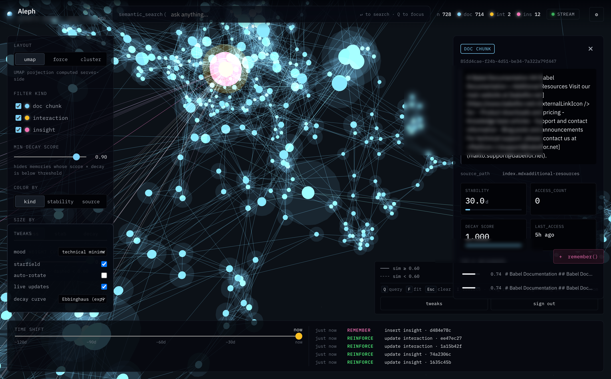

# Aleph Docs

**A reusable template for a documentation-aware LLM knowledge system that
learns from use — across Markdown, images, video, audio and PDF.**



*The Aleph 3D viewer on a live instance: blue nodes are `doc_chunk` memories
embedded from a Markdown repo, yellow are auto-recorded `interaction`
memories from search tools, pink are `insight` memories saved manually via
`remember()`. Edges are top-k cosine neighbors (solid ≥ 0.60, dashed
< 0.60). The right panel shows the selected chunk with its stability,
decay, access count and top-k neighbors; the bottom log streams inserts,
reinforcements and deletes live via Postgres LISTEN/NOTIFY.*

## What this is

Aleph Docs turns any documentation corpus into a **living, multimodal
knowledge system** that an LLM (Claude, ChatGPT, local models via MCP)
can both *read* and *write*. It gives you, out of the box:

- **One MCP server** that indexes your docs and exposes them to any LLM
  via the [Model Context Protocol](https://modelcontextprotocol.io/). It
  understands **Markdown, images, video, audio and PDF** — all embedded
  into one unified vector space, so a single `semantic_search("login
  page broken")` can return a how-to page, a screenshot of the bug, a
  screencast reproducing it, and a voice note from a customer.
- **Pluggable embedding backends** selected at deploy time via one env
  var. Pick `gemini-001` for cheap text-only, `gemini-2-preview` for
  full multimodal, or `local` (Ollama) for \$0 recurring cost and full
  offline operation. Your cost profile matches your use case.
- **One 3D web viewer** (*Aleph*) that shows the evolving knowledge graph
  in real time — so humans can inspect, curate, and navigate the memory
  with the same model the LLM is using. The viewer renders each node
  per-modality: text preview, image thumbnail, playable video segment
  with frame seek, audio player with waveform, PDF page link.
- **A closed feedback loop** between the LLM interactions and the
  canonical docs: insights captured during support sessions can be
  promoted to pull requests on the docs repo with a single tool call.

In one sentence: **git-tracked docs, images, videos, audio and PDFs
become queryable, writeable, and self-maintaining**, with costs measured
in cents per year instead of dollars per month.

## What problem it solves

Most teams who want "an LLM that knows our product" end up building
some variant of plain **RAG** (retrieve-chunks, stuff-into-prompt) or a
**Karpathy-style LLM-Wiki** (have the LLM generate and maintain
Markdown pages manually). Both patterns have known failure modes:

- Plain RAG is **stateless**. Every query rediscovers knowledge from
  scratch. Insights surfaced in one conversation don't enrich the next.
  The system never learns what's important vs. noise.
- LLM-Wiki is **expensive and slow**. Every write involves the LLM
  rereading pages, reconciling them, rewriting chunks. At scale, the
  token bill grows linearly with knowledge base activity.

Aleph Docs takes the best of both and removes the costly parts:

- It keeps Karpathy's *human-readable canonical source of truth* — the
  Markdown git repo. Git history is your audit log for "normative" facts.
- It adds an *operational fast layer* — a pgvector index with an
  Ebbinghaus-style forgetting curve — where interactions reinforce
  themselves, duplicates collapse automatically, and useless noise fades.
- It only calls the LLM where an LLM is strictly necessary (contradiction
  detection). Everything else — search, dedup, orphan detection,
  staleness — is plain SQL.

The result is a system that **gets smarter the more you use it**, costs
a few cents a year to maintain, and never loses the audit trail.

## Who it's for

- Customer support teams who want their knowledge base to accumulate
  customer-specific gotchas and workarounds without drift.
- Engineering docs owners who want "the docs" to include both the
  pristine prose in git *and* the field-tested knowledge from support.
- LLM-agent builders who need a fast, cost-predictable retrieval layer
  with proper write semantics (not just a vector-DB wrapper).
- Anyone who has tried "let the LLM maintain the wiki" and hit the
  token bill wall.

---

## Aleph Docs vs alternatives

| Dimension | **Plain RAG** (vector DB + prompt stuffing) | **LLM-Wiki** (Karpathy + Obsidian) | **Aleph Docs** (this) |
|---|---|---|---|
| **State across sessions** | None — stateless | Markdown files persist, curated by LLM | Vector memory + git Markdown, both tracked |
| **Retrieval latency** | Sub-200ms (vector only) | Multi-second (LLM rereads pages) | Sub-200ms (pgvector HNSW) |
| **Write cost per entry** | N/A (read-only) | High — LLM rewrites pages | ~$0.0005 (embedding only) |
| **Dedup** | None; same content re-indexed repeatedly | Up to the LLM to notice | Automatic: sim > 0.9 → reinforce instead of insert |
| **Freshness / decay** | None | None (files never decay) | Built-in: Ebbinghaus forgetting curve per row |
| **Contradictions** | Invisible — both hits rank equally | LLM lint finds them by rereading pages | Cheap SQL to find candidates, LLM judges only the top 20 |
| **Audit trail** | At best, vector-DB row history | `git blame` on `.md` files | Both: `memory_audit` table + git log of canonical repo |
| **Serendipity** (find unexpected connections) | Weak — similarity lost in prompt | Limited to explicit wikilinks | UMAP 3D projection surfaces latent clusters |
| **Visualization** | None (vectors aren't human-readable) | Obsidian 2D graph (explicit links only) | Real-time 3D viewer with decay, live writes, audit history |
| **Loop back to canonical docs** | None | Manual rewriting | `find_doc_gaps` → `suggest_doc_update` → LLM writes prose → `propose_doc_patch` opens a PR. Guardrails refuse the PR when the target page or the supporting insights are too weak, and propose creating a new page when no existing one fits. |
| **Modalities supported** | Usually text only | Text only | Text + image + video + audio + PDF (one unified vector space) |
| **Offline / local** | Easy (any local vector DB) | Easy (any local LLM + files) | Yes — `EMBED_BACKEND=local` runs fully offline via Ollama |
| **Predictable cost** | Low and flat | Grows with knowledge base size | Capped: SQL-free for most work, LLM budget hard-limited |
| **Typical yearly cost** | Embedding only | $10–$100s depending on LLM usage | $0.12 bootstrap + ~$0.06/year lint |

### Why not just plain RAG?

- **Memory evolution** — RAG doesn't remember that a user corrected it yesterday. Aleph Docs auto-records every search as an `interaction` memory, dedups by semantic similarity, reinforces what's actually useful, and decays what isn't touched.
- **Writable** — `remember(content, context)` stores a new insight in one call, addressable by UUID, retrievable by future semantic searches. Plain RAG has no write path; you re-run an indexing job and hope it picks things up.
- **Citation quality** — every answer can cite a concrete `source_path` (for docs) or a memory UUID (for insights), with an audit trail for each. RAG typically retrieves an opaque chunk with no provenance.

### Why not just LLM-Wiki + Obsidian?

- **Scale** — LLM-Wiki ingestion costs grow linearly with every new source. Aleph Docs ingests docs via deterministic chunking + embedding (no LLM in the loop), so bootstrap of thousands of pages is a few cents.
- **Write latency** — Saving a Markdown page via an LLM takes seconds. `remember()` returns in <1s regardless of how busy the LLM is.
- **No LLM-generated drift** — LLM-Wiki pages drift as the LLM rewrites them to reconcile new sources. Aleph Docs keeps canonical docs 100% human-edited (git-tracked); the LLM only proposes PRs — you merge them with human review.
- **Machine-queryable** — vector search is O(log N) with HNSW; "the LLM greps the wiki" is O(N token reads). At 10k+ memories, the difference is order-of-magnitude.

### What Aleph Docs keeps from each

- From **RAG**: sub-200ms vector retrieval, HNSW index, Gemini embeddings, cheap writes.
- From **LLM-Wiki**: Markdown files in git as the canonical source, PR review workflow, audit via `git log`, human-readable knowledge layer that survives vector DB resets.
- Added on top: forgetting curve, dedup, auto-reinforcement, visual graph, lint, explicit write/forget semantics, single-tool PR workflow back to canonical docs.

### When it's probably **not** the right tool

- You have **fewer than ~50 documents** total and prefer a plain wiki. Aleph's pgvector infrastructure is overkill.
- You need **fully offline / air-gapped**. The default stack uses Gemini for embeddings; swap to a local model (Ollama + BGE-M3) works but is not the default path.
- You don't have **any canonical docs** to index. Aleph assumes there's a git repo of Markdown to ground answers; if you only have scattered notes, adopt a minimal docs layout first.

---

> **Starting a new deployment?** Follow [`SETUP.md`](SETUP.md) — it's
> written as an AI-coder runbook, step by step, from a blank VM to a
> working system.

---

## What you get

| Capability | Implementation |
|---|---|
| **Multimodal corpora** | Markdown / images / video / audio / PDF indexed side by side into one pgvector space |
| **Pluggable embedders** | `gemini-001` / `gemini-2-preview` / `local` (Ollama) selectable via `EMBED_BACKEND` env |
| Lexical search over docs | SQLite FTS5, kept in sync incrementally — `git diff` in git mode, `watchdog` + SHA-256 diff in local mode |
| Semantic search (docs + insights + interactions, across modalities) | pgvector HNSW with cosine + Ebbinghaus decay (canonical kinds — docs, images, pdf pages, video scenes, audio clips — are exempt from decay and never fall off) |
| Auto-reinforcement | Every hit bumps `stability × 1.7`, `access_count += 1` |
| Manual knowledge capture | `remember(content, context)` for text, `remember_media(path)` for files |
| Manual pruning | `forget(memory_id)` with audit snapshot preserved |
| Audit trail | `memory_audit` table + `audit_history` MCP tool |
| Exact memory counts | `memory_stats()` returns per-kind counts (semantic_search is capped at 50 rows so LLM clients can't otherwise know the totals) |
| Gap detection | `find_doc_gaps(max_top_sim, limit)` — surfaces interactions whose best doc_chunk match is weak; each row is a PR seed |
| Doc-patch flow | Three-step: `suggest_doc_update(topic)` → the LLM reads the target section and composes prose → `propose_doc_patch(topic, prose, ...)` commits on a branch. Two guardrails built-in: `fallback_proposal` suggests creating a new page when no existing target is close enough; `abort_recommendation` refuses the PR when supporting insights are only loosely related. |
| New-page mode | `propose_doc_patch(create_new_file=True, new_path, new_title, prose)` writes a brand-new markdown file when the fallback is accepted |
| Quality linting | `lint_run` with 4 checks (orphan, redundant, stale, contradiction) + cost-capped LLM judge |
| Live 3D viewer | UMAP + HDBSCAN projection, SSE patches, right-panel with audit history, per-modality renderers (image / video / audio / PDF) |
| Docker-native | `docker compose up` — Postgres + MCP + viewer in one command |
| Multi-layer auth | Apache Basic Auth on perimeter + `X-Aleph-Key` on write endpoints |
| Idempotent deploy | `deploy-mcp.sh` and `deploy-aleph.sh` safe to re-run |

---

## Repository layout

```
aleph-docs/
├── README.md                 # this file
├── SETUP.md                  # step-by-step bring-up runbook
├── ARCHITECTURE.md           # design notes + diagrams
├── .env.example              # top-level env template (copy to .env before deploy)
│
├── Dockerfile                # multi-stage: frontend build → python runtime
├── docker-compose.yml        # db + mcp + aleph, one command
├── .env.docker.example       # docker-specific env template
│
├── mcp/                      # the MCP server
│   ├── server.py             # FastMCP app + /health + /mcp + /sse
│   ├── indexer.py            # markdown + media → SQLite FTS5 + pgvector
│   ├── auth.py               # bearer-token middleware
│   ├── helpers.py
│   ├── requirements.txt
│   ├── memory/               # the semantic memory core
│   │   ├── schema.sql        # all DDL (idempotent, incl. media columns)
│   │   ├── db.py             # async psycopg pool + pgvector
│   │   ├── embedders/        # pluggable backend registry
│   │   │   ├── base.py       # Backend protocol + BackendError
│   │   │   ├── gemini_001.py # text-only, default
│   │   │   ├── gemini_2.py   # multimodal preview
│   │   │   └── local.py      # Ollama offline
│   │   ├── embeddings.py     # thin shim forwarding to the active backend
│   │   ├── chunker.py        # H2/H3-aware markdown chunking
│   │   ├── chunker_image.py  # image → 1 MediaChunk
│   │   ├── chunker_video.py  # video → N keyframe-based scene chunks
│   │   ├── chunker_audio.py  # audio → N overlapping window chunks
│   │   ├── chunker_pdf.py    # pdf → 1 chunk per page
│   │   ├── media.py          # MIME detection + thumbnailing
│   │   ├── ffmpeg_utils.py   # ffprobe + keyframe + segmentation
│   │   ├── types.py          # MediaChunk shared dataclass
│   │   ├── store.py          # CRUD + forgetting-curve + upsert_media_chunk
│   │   ├── reinforce.py      # @record_interaction decorator
│   │   ├── bootstrap.py      # one-shot: embed all docs + media
│   │   ├── audit.py          # best-effort write-log
│   │   ├── doc_patch.py      # git branch+commit+PR helpers
│   │   ├── lint.py           # quality checks
│   │   └── lint_cli.py       # CLI + systemd entry
│   ├── tools/                # FastMCP tool modules
│   │   ├── search.py         # search_docs, search_code_examples, find_related
│   │   ├── lookup.py         # find_command_line_option, find_error_message, find_api_endpoint
│   │   ├── navigation.py     # list_sections, get_page_tree, list_pages
│   │   ├── content.py        # get_page, get_page_section, get_code_blocks
│   │   ├── meta.py           # get_doc_stats, get_changelog
│   │   └── memory.py         # semantic_search, remember, remember_media, recall,
│   │                         # forget, audit_history, memory_stats, find_doc_gaps,
│   │                         # suggest_doc_update, propose_doc_patch,
│   │                         # lint_run, lint_findings, lint_resolve
│   ├── systemd/              # service + timer units (templates)
│   ├── tests/                # pytest (pytest-postgresql)
│   └── deploy-mcp.sh         # idempotent production deploy script
│
└── aleph/                    # the 3D viewer
    ├── backend/              # FastAPI on 8765, reuses mcp.memory
    │   ├── main.py
    │   ├── db.py             # graph_snapshot + audit helpers
    │   ├── projection.py     # UMAP + HDBSCAN + top-k neighbors
    │   ├── mcp_bridge.py
    │   ├── auth.py
    │   ├── schema_additions.sql
    │   ├── triggers.sql      # LISTEN/NOTIFY on memories writes
    │   ├── requirements.txt
    │   └── tests/
    ├── frontend/             # Vite + React + Three.js
    │   ├── index.html
    │   ├── login.html        # custom Basic-Auth login
    │   ├── vite.config.js
    │   └── src/              # Scene, App, UI, store, api, styles
    ├── systemd/
    └── deploy-aleph.sh
```

---

## Where do your docs live?

Aleph Docs supports **two mutually exclusive change-detection modes**.
The active mode is derived from whether `DOCS_REPO_URL` is set — no
separate flag, no runtime toggle. Pick the one that matches how your
team authors docs.

| Mode | Activated by | Change detection | Watcher |
|---|---|---|---|
| **Local (filesystem)** | `DOCS_REPO_URL` empty/absent (**default**) | Walk `docs/` at boot, diff by `source_path + SHA-256` against the `memories` table | Yes — `watchdog` with 2 s debounce (add/update/delete detected in real time) |
| **Git repo** | `DOCS_REPO_URL` set | `git diff --name-status $last_media_commit_hash..HEAD` — authoritative per commit | No (the indexer-owned clone would race with pulls) |

Both modes are **incremental and idempotent**. The reconciler computes
SHA-256 of each file only when `mtime + size` changed, cascade-deletes
chunks when a file is removed, and never re-embeds content that is
already in the DB. The first boot runs the reconcile as a background
task so the MCP server is reachable immediately — progress is exposed
on `GET /health` under the `ingest` field.

### Local (filesystem) mode — the default

Works out of the box: drop anything into `./docs/` and the MCP picks
it up. Supports markdown (`.md`, `.mdx`), images (`.png`, `.jpg`,
`.jpeg`, `.webp`), videos (`.mp4`, `.mov`), audio (`.mp3`, `.wav`),
and PDFs. Subfolders are free-form — there is no required layout.

```bash
# .env — the minimum for local mode
DOCS_REPO_URL=                    # leave empty (default)
EMBED_BACKEND=gemini-2-preview    # required for video/audio/pdf/image
GOOGLE_API_KEY=<your key>
INGEST_MEDIA_ON_BOOT=true         # default; set false to skip the boot scan
```

At runtime, the filesystem watcher is started automatically by the MCP
server (`memory.watcher.start_if_local`). Drop a new MP4 into
`./docs/videos/course-1/` and it appears as a coral-pink node in the
viewer within a few seconds. Remove a PDF and its pages are deleted
from the memory (cascade by `source_path`). No restart needed.

To force an immediate re-scan (e.g. after a big `cp -r` or if the
watcher missed events because the container was down), call the MCP
tool `reindex_docs()` from your LLM client, or bounce the container
with `docker compose restart mcp`.

### Git mode

Use when docs have their own review cycle and live in a separate
repository. The indexer clones it into the `mcp_data` named volume
and pulls `main` (or `DOCS_REPO_BRANCH`) on each MCP restart. Git
itself is the source of truth for add / update / delete — no
filesystem watcher, no hashing of the worktree.

```bash
# .env — git mode
DOCS_REPO_URL=https://github.com/YOURORG/your-docs.git
DOCS_REPO_BRANCH=main
DOCS_REPO_TOKEN=ghp_xxx           # PAT with repo:read; only for private repos
DOCS_REPO_PATH=repo               # where to clone inside the mcp container
CONTENT_SUBDIR=content            # default; set to "" if markdown is in the repo root
EMBED_BACKEND=gemini-2-preview
GOOGLE_API_KEY=<your key>
```

When `DOCS_REPO_URL` is set, the local `./docs/` folder is ignored —
push changes to the remote repo and the indexer picks them up on the
next restart (or the next call to `reindex_docs()`). Because git diff
is precise, git mode avoids false positives from editor save-rename
cycles and partial writes that a filesystem watcher can briefly see.

### Switching between modes

Changing `DOCS_REPO_URL` after a successful ingest is a destructive
operation: `source_path` values differ between the two modes
(`/docs/foo.mp4` vs `/app/repo/content/foo.mp4`), so the new reconciler
would import everything fresh while the old rows would linger as
orphans. Do a clean switch:

```bash
docker compose down -v        # wipe both pgvector and the SQLite meta
docker compose up -d --build  # ingest from scratch in the new mode
```

### Auto-rebuilding the 3D graph

The viewer renders a UMAP snapshot (`graph_snapshot` table). A
background task inside the `aleph` container listens for
`memory_change` NOTIFY events and rebuilds the snapshot with a
debounce policy: after 30 s of quiet (tunable via
`PROJECTION_DEBOUNCE_S`), or every 120 s during a long ingest burst
(tunable via `PROJECTION_MAX_STALE_S`), whichever fires first. Set
`AUTO_PROJECTION=false` to disable and run `python -m backend.projection`
inside the container manually.

See [`docs/README.md`](docs/README.md) for a walkthrough of populating
the local corpus, and [`ARCHITECTURE.md`](ARCHITECTURE.md) for the
reconciler data flow.

---

## ⚠️ Costs — READ BEFORE INGESTING

**Aleph Docs calls paid third-party AI APIs (Gemini / Vertex AI by
default, or whatever `EMBED_BACKEND` points to) every time a file is
indexed, re-indexed after a content change, or queried for semantic
search. You — the operator running this stack — are billed directly by
that provider through your own billing account. There is no middleware
in this project that caps, meters, refunds, or aggregates those
charges. Whatever your corpus triggers, your card pays.**

### No warranty, no cost liability

This project is distributed under the PolyForm Noncommercial License
(see [`LICENSE`](LICENSE)) "AS IS", **without warranty of any kind**.
In particular, and without limitation:

- **The maintainers and contributors of Aleph Docs are not responsible
  for any charges, overage, quota exhaustion, bill shock, surprise
  invoice, unexpected spend or financial loss you incur by running
  this software against any paid API.**
- **You alone are responsible** for understanding the pricing of the
  embedder backend and any other AI service you configure, for setting
  budgets and alerts on your cloud account, and for sizing the corpus
  and the reconcile cadence to your budget.
- **Running `docker compose up` on a large corpus can cost real money
  within minutes** — especially with video or audio files on
  `gemini-2-preview`. A single 60-minute video processed through the
  video-scene chunker can produce dozens of embed calls; a 1000-page
  PDF corpus similarly. See the estimates below and work out your own
  number *before* starting the ingest.
- **No backend provides a "dry run" that previews exact spend.** Any
  figure here is an approximation from publicly listed prices at the
  time of writing — prices change, and your actual invoice may differ.

**If you are not prepared to be responsible for these charges, do not
run this software.** Use at your own risk.

### Indicative pricing per backend

Pricing below is **paid-tier** unit cost as listed by each provider at
the time of writing (April 2026). **Always verify the current price
on the provider's official page before running any large ingest** —
the links are in the last column.

| Backend | Modality | Unit | Price (paid tier) | Source |
|---|---|---|---|---|
| `gemini-001` | Text (md chunks) | per 1M input tokens | **$0.15** | [ai.google.dev pricing](https://ai.google.dev/gemini-api/docs/pricing) |
| `gemini-2-preview` | Text | per 1M tokens | **$0.20** | same |
| `gemini-2-preview` | **Image** (incl. PDF pages rendered as PNG) | per image | **$0.00012** | same |
| `gemini-2-preview` | **Audio** | per 1M tokens | **$6.50** | same |
| `gemini-2-preview` | **Video** | per frame @ 1 fps | **$0.00079** | same |
| `local` (Ollama + BGE-M3) | Any (uses local compute) | **$0** recurring | electricity only | [Ollama models](https://ollama.com/library) |
| `nomic_multimodal_local` | Text + Image (incl. video keyframes, via host server) | **$0** recurring | electricity only (~2 GB one-time weight download) | [docs/EMBED_NOMIC_SETUP.md](docs/EMBED_NOMIC_SETUP.md) |

**ASR (speech-to-text)** is a separate cost dimension: when `ASR_ENABLED=true`
the video/audio chunkers call the selected `ASR_BACKEND` for each
scene/clip to produce a transcript, then embed that transcript as text
(trivial cost on top of the embedder). The ASR cost itself depends on
the backend:

| `ASR_BACKEND` | Cost per minute | Key needed | Notes |
|---|---|---|---|
| `whisper_local` (default) | **$0** | none | Runs whisper.cpp on your host (5-10× realtime on Apple Silicon Metal) or falls back to `faster-whisper` inside the mcp container (CPU-bound, ~0.5× realtime — slow for bulk ingest). See "Running Whisper locally" below. |
| `openai` | **~$0.006** | `OPENAI_API_KEY` | OpenAI's `whisper-1` — 30 h of course ≈ **~$11**. Cheapest cloud path. |
| `gemini` | **~$0.01** | `GOOGLE_API_KEY` | `gemini-2.5-flash` with audio input — 30 h of course ≈ **~$18**. Reuses the same key as the embedder. |

Per-scene the total spend is **embedder cost + ASR cost** (both
computed once at ingest, not per query). Query cost stays trivial
(one small text embed per search).

### Ballpark cost per corpus size

These are **order-of-magnitude** estimates, not quotes. Real cost
depends on average chunk size, scene detection density for video,
number of pages per PDF, and how often content changes (a full
re-reconcile hashes everything but only re-embeds what differs).

**Assumptions:** `gemini-2-preview`, one full boot-time ingest with
no retries. Re-running the reconciler without content changes costs
**zero API calls** thanks to the SHA-256 idempotency, but replacing
a single large video costs the full cost of re-embedding all its
scenes.

| Corpus example | Approx. embed calls | Approx. one-shot cost |
|---|---|---|
| 50 `.md` pages (500 tokens each) | 50 text calls | **< $0.01** |
| 10 PDFs × 30 pages each (pages rendered as images) | ~300 image calls | **~$0.04** |
| 10 MP4 videos × 10 min × ~10 scenes/video (avg 60 s/scene) | ~100 video calls @ 60 frames each | **~$4.70** |
| 34 MP4 videos × 15 min × ~10 scenes/video (avg 90 s) | ~340 video calls @ 90 frames each | **~$24** |
| 1 hr audio file (wav/mp3) | 1 audio call at ~60 min token cost | **varies — query `$6.50/1M` × actual tokens** |

### Hard rules before you ingest

1. **Set a billing alert on your GCP / provider account first.** On
   GCP: [Billing → Budgets & alerts](https://console.cloud.google.com/billing/budgets) — a $10 alert is a cheap insurance policy.
2. **Start with `INGEST_MEDIA_ON_BOOT=false`** and trigger the
   reconciler manually via the `reindex_docs()` MCP tool after you
   have reviewed the file count.
3. **Test on a small subset** (5-10 files) before the full corpus.
   The per-file cost logged in `/health.ingest.last_summary` gives
   you the actual rate before you commit to the whole dataset.
4. **Watch `/health` during ingest** — the `ingest.processed` counter
   tells you how many files have been billed so far.
5. **If you see unexpected 429 `RESOURCE_EXHAUSTED` errors**, your
   provider has rate-limited you (not billed — those calls are free).
   Do **not** add client-side retries until you understand your
   quota; retries on a genuine quota exhaustion can turn a rate limit
   into a real bill if the backend finally accepts the retried call.

**Once again: you are fully and solely responsible for any and all
charges your account incurs by running this software. The authors
accept no liability for any costs, direct or indirect, resulting from
the use of this project. Use at your own risk.**

---

## Zero-cost alternative — fully offline with Ollama

If you want to avoid paid APIs entirely, set `EMBED_BACKEND=local` and
embed locally via [Ollama](https://ollama.com). The backend is wired
at `mcp/memory/embedders/local.py` and speaks Ollama's HTTP API — **no
outbound calls, no cloud keys, no billing surface**. Recurring cost:
electricity only.

### Two caveats to know up-front

1. **Text only.** The local backend declares `modalities =
   frozenset({"text"})`. Markdown (`.md`, `.mdx`) ingest works; PDF,
   image, video and audio files are rejected by the reconciler with a
   clear error surfaced in `/health.ingest.errors` — **nothing is
   silently skipped or billed**. If you need multimodal embedding
   offline, you'll need a CLIP-style model; that's not wired in this
   template and is out of scope for the `local` backend today.
2. **No Matryoshka truncation.** `EMBED_DIM` must exactly match the
   model's native output dimension (set `LOCAL_EMBED_DIM` to the same
   value). Switching to `local` from a DB previously populated with
   `gemini-*` (1536-dim) requires a schema reset because the
   `vector(N)` column dimension changes — see "Switching backends"
   below.

### Install + run Ollama on the host

```bash
# macOS / Linux: one-line install
curl -fsSL https://ollama.com/install.sh | sh

# Pick an embedding model (see comparison below); bge-m3 is the default
ollama pull bge-m3

# Start the daemon if it isn't already running under launchd/systemd
ollama serve &
```

Verify: `curl -s http://127.0.0.1:11434/api/tags` returns JSON with the
model you just pulled.

### Configure `.env`

```bash
# --- Local embedder ---
EMBED_BACKEND=local
EMBED_DIM=1024                # MUST match LOCAL_EMBED_DIM exactly
LOCAL_EMBED_DIM=1024          # native dim of the chosen Ollama model
OLLAMA_MODEL=bge-m3           # or any model you pulled
OLLAMA_HOST=http://127.0.0.1:11434
```

**Reaching Ollama from the MCP container.** When `mcp` runs in Docker
and Ollama is on the host, loopback doesn't resolve — use the
platform-specific host alias:

| Host OS | `OLLAMA_HOST` |
|---|---|
| macOS / Windows (Docker Desktop) | `http://host.docker.internal:11434` |
| Linux (default docker0 bridge) | `http://172.17.0.1:11434` |

### Recommended embedding models

All are available via `ollama pull`. Pick one based on language coverage
and hardware.

| Model | Native dim | MTEB quality | Language | Pull command |
|---|---|---|---|---|
| `bge-m3` | 1024 | ⭐⭐⭐⭐ | Multilingual (100+ langs, EN/IT/ES/…) | `ollama pull bge-m3` |
| `mxbai-embed-large` | 1024 | ⭐⭐⭐⭐ | English-focused | `ollama pull mxbai-embed-large` |
| `nomic-embed-text` | 768 | ⭐⭐⭐ | English, faster on small hardware | `ollama pull nomic-embed-text` |

Whatever you pick, **`LOCAL_EMBED_DIM` must match the model's output
dimension**, otherwise the backend fails fast with
`BackendError: model returned dim=X, expected native_dim=Y`.

### Switching backends — destructive DB reset

Because pgvector columns are typed with a fixed dimension, you cannot
switch between backends of different dim without recreating the
`memories.embedding` column. The safe path is a full volume wipe:

```bash
docker compose down -v      # drop pgvector + mcp_data
# edit .env to the new backend + matching EMBED_DIM
docker compose up -d --build
```

You will re-ingest everything from `docs/` under the new backend. With
`local` this is free (Ollama is local) but takes CPU/GPU time; budget
a few seconds per chunk on a modern laptop.

### When to still prefer the cloud backends

- You need **multimodal** (PDF / image / video / audio) — stay on
  `gemini-2-preview`.
- Your corpus is **small** (a few hundred markdown chunks) and
  installing Ollama is more friction than paying cents. `gemini-001`
  on the free tier often covers this for zero cost.
- You want **consistent quality** across machines — Ollama embedding
  quality varies with the hardware and the model version; Gemini is
  version-pinned.

See [`.env.example`](.env.example) for the full list of `OLLAMA_*` knobs.

### Adding image / video-keyframe retrieval — `nomic_multimodal_local`

The `local` backend is text-only. If you want **cross-modal retrieval
at zero recurring cost** — "find the slide with the candlestick
chart" even when the instructor never says those words — use
`EMBED_BACKEND=nomic_multimodal_local` instead. It routes text to
[`nomic-embed-text-v1.5`](https://huggingface.co/nomic-ai/nomic-embed-text-v1.5)
and images to [`nomic-embed-vision-v1.5`](https://huggingface.co/nomic-ai/nomic-embed-vision-v1.5) —
both 768-dim, **same latent space**, so `cosine(text, image)` is
meaningful.

Because the torch dep + ~2 GB of weights are too heavy for the mcp
container, the models run on a small FastAPI server **on the host**
(same host-bridge pattern as whisper.cpp), reached via
`host.docker.internal:8091`. On Apple Silicon the server uses Metal
(MPS) automatically.

See [`docs/EMBED_NOMIC_SETUP.md`](docs/EMBED_NOMIC_SETUP.md) for the
step-by-step walkthrough. Quick-config once the server is running:

```bash
EMBED_BACKEND=nomic_multimodal_local
EMBED_DIM=768                               # must match model native dim
HYBRID_MEDIA_EMBEDDING=true                 # enables keyframe images on videos
EMBED_NOMIC_HOST=http://host.docker.internal:8091
```

Then wipe + rebuild the DB (dim change 1024 → 768):

```bash
docker compose down -v && docker compose up -d --build
```

With `HYBRID_MEDIA_EMBEDDING=true`, each video scene emits a
`video_transcript` row **and** a per-scene keyframe `image` row
(metadata `origin=video_keyframe`) — so queries hit both what was
said *and* what was shown. Standalone images and PDF pages rendered
as images are embedded in the same space.

Limitation: the backend does not embed raw video / audio / PDF blobs
(only still frames + text). For full-media embedding stay on
`gemini-2-preview`.

---

## Running Whisper locally for free transcripts

When `ASR_BACKEND=whisper_local` (the default), the aleph MCP
transcribes every video scene and audio clip locally via
[`whisper.cpp`](https://github.com/ggerganov/whisper.cpp) — no API
keys, no per-minute bill. Two configurations, picked automatically
based on whether `ASR_HOST` is set:

### Host HTTP bridge (recommended — fast path)

Run whisper.cpp as an HTTP server on your host so the mcp container
can reach it over `host.docker.internal`. On Apple Silicon this
uses Metal acceleration: large-v3 runs at **5-10× realtime**, so a
30 h course is transcribed in 3-6 h wall time with the CPU free for
your other work.

```bash
# 1. Build whisper.cpp with Metal (macOS) or BLAS (Linux)
git clone https://github.com/ggerganov/whisper.cpp
cd whisper.cpp
make -j                                   # enables Metal on Apple Silicon
bash ./models/download-ggml-model.sh large-v3

# 2. Start the HTTP server
./build/bin/whisper-server \
    -m models/ggml-large-v3.bin \
    --host 0.0.0.0 --port 8090 \
    --convert

# 3. Test it
curl -F file=@any-short-audio.wav http://localhost:8090/inference
# Expected: {"text":"..."}
```

Then in `.env`:

```bash
ASR_BACKEND=whisper_local          # default; kept for clarity
ASR_HOST=http://host.docker.internal:8090   # macOS / Windows
# ASR_HOST=http://172.17.0.1:8090            # Linux (default docker0)
ASR_LANGUAGE=                       # auto-detect; set 'it'/'en' for speed
ASR_MODEL=large-v3                  # informational — the server owns the model
```

Restart the mcp container (`docker compose up -d`). New video/audio
files ingested from that point onward include transcripts. Existing
rows are untouched until their source file's SHA-256 changes (by
design — transcription is the slow part of ingest and you don't
want it to run on every restart).

### In-container fallback (slow, automatic)

When `ASR_HOST` is unset (or unreachable), the mcp container
transparently falls back to `faster-whisper` on CPU. First call
downloads the model (~3 GB for large-v3, cached in the `mcp_data`
volume). Speed is ~0.5× realtime — acceptable for a handful of
short files, prohibitively slow for a large course.

Override the default model if disk/RAM is tight:

```bash
ASR_MODEL=medium    # ~1.5 GB, ~2× realtime on CPU
ASR_MODEL=small     # ~500 MB, ~3× realtime on CPU, lower accuracy
```

A one-time warning is logged when the fallback kicks in, so you
know you're not on the fast path.

### Disabling ASR

Set `ASR_ENABLED=false`. The chunker then emits the legacy
`"scene N @ Xs"` placeholder content on `video_scene` rows and
produces no `video_transcript` rows — identical to the
pre-transcription behaviour.

### Fully zero-cost ingest — `HYBRID_MEDIA_EMBEDDING=false`

The hybrid pipeline produces **two** rows per scene/clip/page:
a media-embedded row (expensive with Gemini multimodal) and a paired
text-embedded row (transcript / extracted page text — trivial cost).
For a corpus you only query with text ("what does the instructor say
about X?", "which page covers Y?"), the media side is pure
unnecessary spend.

Set `HYBRID_MEDIA_EMBEDDING=false` and the chunkers skip the media
rows entirely:

| Source file | With HYBRID=true | With HYBRID=false |
|---|---|---|
| video `.mp4` / `.mov` | `video_scene` + `video_transcript` | `video_transcript` only |
| audio `.mp3` / `.wav` | `audio_clip` + `audio_transcript` | `audio_transcript` only |
| PDF `.pdf` | `pdf_page` (image) + embedded `image` rows | `pdf_text` (extracted text per page) |
| standalone image `.png`/`.jpg` | `image` | **skipped** (no text to embed) |
| markdown `.md`/`.mdx` | `doc_chunk` | `doc_chunk` (unchanged) |

Because every surviving chunk is text-embedded, you can combine this
with any text-only backend — including `EMBED_BACKEND=local`
(Ollama + `bge-m3`) — for a **$0 recurring cost** pipeline where
Whisper transcribes video/audio locally and Ollama embeds locally.
A 30 h course + a few hundred PDF pages ingests in a few hours, total
spend zero.

Re-enable HYBRID later by `docker compose down -v` + flipping the
flag + `up` — the schema dim reset (see below) is the only friction.

### ⚠️ Switching `EMBED_BACKEND` resets the pgvector schema

pgvector columns are typed as `vector(N)` where `N` is fixed at
`CREATE TABLE` time. Different backends produce different dims:

| Backend | `EMBED_DIM` |
|---|---|
| `gemini-001`, `gemini-2-preview` | 1536 |
| `local` + `bge-m3` | 1024 |
| `local` + `nomic-embed-text` | 768 |
| `nomic_multimodal_local` | 768 |

Changing the backend therefore requires a schema rebuild. The db
container's `init-memory.sh` wrapper reads `EMBED_DIM` from the
environment at first-boot and renders the schema with the right dim;
**the init script only runs on an empty data directory**. To switch:

```bash
docker compose down -v     # drop db_data + mcp_data
# edit .env: flip EMBED_BACKEND, EMBED_DIM, LOCAL_EMBED_DIM, HYBRID_MEDIA_EMBEDDING
docker compose up -d --build
```

---

## Quick start with Docker (2 minutes)

The fastest way to try Aleph Docs: `docker compose up`. A single command
starts PostgreSQL + pgvector, the MCP server, and the Aleph viewer. Your
documentation folder is mounted read-only; Claude Desktop can connect
directly to the MCP exposed by the container.

```bash
git clone https://github.com/albertoferrazzoli/aleph-docs.git
cd aleph-docs

# 1. Configure (required: MCP_API_KEY, ALEPH_API_KEY, GOOGLE_API_KEY)
cp .env.docker.example .env
$EDITOR .env
# Generate the two API-key secrets with: openssl rand -hex 32

# 2. Drop your documentation into ./docs/  (.md, .pdf, .png, .mp4, .wav, …)
#    Supported formats depend on EMBED_BACKEND (see .env comments).

# 3. Start the stack
docker compose up --build

# 4. Open the viewer
open http://localhost:8765/

# 5. Connect Claude Desktop (see "Connecting Claude Desktop" below for
#    the full config; Claude Desktop needs an stdio bridge, not a
#    direct URL).
```

Everything persists across restarts:
- Postgres data → `db_data` named volume
- MCP index + cloned repo → `mcp_data` named volume
- Your documentation files → the bind-mounted `./docs/` directory

To stop cleanly: `docker compose down`. To wipe everything:
`docker compose down -v`.

### Docker architecture

```
  ./docs/  ───►  [ mcp ]  ─┐
                 :8001     │
                           ├──►  [ db ]   (postgres 16 + pgvector)
  browser  ───►  [ aleph ] ┘
                 :8765

  Claude Desktop ──► http://localhost:8001/mcp  (Bearer MCP_API_KEY)
```

- `db` uses `pgvector/pgvector:pg16` — no manual install.
- `mcp` + `aleph` share the memory package and the docs mount.
- `ffmpeg` pre-installed in both runtime images (video/audio chunking).
- No Apache / reverse proxy in the container — add your own TLS/auth
  in front if you expose beyond localhost.

See [`docker-compose.yml`](docker-compose.yml) and
[`.env.docker.example`](.env.docker.example) for every knob.

---

## Quick start (local, 10 minutes)

1. **Prereqs**
   - macOS / Linux with Python 3.11+, Node 20+, PostgreSQL 16+, pgvector.
   - A Gemini API key (free tier works for bootstrap at scale).
   - **Optionally**, a GitHub repo with your docs — or just use `./docs/`.

2. **Clone + configure**
   ```bash
   git clone git@github.com:YOURORG/aleph-docs.git
   cd aleph-docs
   cp .env.example .env
   # Edit .env: set DOCS_REPO_URL, DOCS_REPO_TOKEN, GOOGLE_API_KEY, PG_DSN,
   # MCP_API_KEY, ALEPH_API_KEY, HTPASSWD_USER, HTPASSWD_PASSWORD
   ```

3. **Local Postgres + pgvector**
   ```bash
   brew install postgresql@16 pgvector     # Linux: use PGDG apt + postgresql-16-pgvector
   createdb aleph_memory
   psql aleph_memory -c "CREATE EXTENSION IF NOT EXISTS vector"
   psql aleph_memory -c "CREATE EXTENSION IF NOT EXISTS pgcrypto"
   psql aleph_memory -f mcp/memory/schema.sql
   psql aleph_memory -f aleph/backend/schema_additions.sql
   psql aleph_memory -f aleph/backend/triggers.sql
   ```

4. **MCP server**
   ```bash
   cd mcp
   python3 -m venv .venv
   .venv/bin/pip install -r requirements.txt
   .venv/bin/python -m memory.bootstrap   # first-time embedding
   .venv/bin/python server.py             # http://127.0.0.1:8001
   ```

5. **Aleph viewer**
   ```bash
   cd ../aleph/backend
   python3 -m venv .venv
   .venv/bin/pip install -r requirements.txt
   .venv/bin/uvicorn main:app --reload --port 8765 &
   cd ../frontend
   npm install
   npm run dev     # http://localhost:5173/aleph/login.html
   ```

Full production bring-up (systemd, Apache reverse proxy, TLS, etc.) is in
[`SETUP.md`](SETUP.md).

---

## Connecting Claude Desktop

### Docker setup (local, most common)

When the stack runs via `docker compose up` on your machine, the MCP is
exposed on `http://localhost:8001/mcp` (or whatever port you set in
`MCP_PORT`). Claude Desktop does **not** speak HTTP-MCP natively — you
need the [`mcp-remote`](https://www.npmjs.com/package/mcp-remote)
stdio bridge (shipped with `npx`, no install required).

**Prereqs**: Node.js 18+ (comes with `npx`). Check with `node --version`.

**Edit** `~/Library/Application Support/Claude/claude_desktop_config.json`
(macOS) or `%APPDATA%\Claude\claude_desktop_config.json` (Windows).
Merge the `mcpServers` block — keep any existing servers you have:

```jsonc
{
  "mcpServers": {
    "aleph-docs-local": {
      "command": "npx",
      "args": [
        "-y", "mcp-remote",
        "http://localhost:8001/mcp",
        "--header",
        "Authorization:Bearer <YOUR_MCP_API_KEY>"
      ]
    }
  }
}
```

Replace `<YOUR_MCP_API_KEY>` with the value from your `.env`. If you
changed `MCP_PORT`, update the URL accordingly (e.g. `8002`).

**Restart Claude Desktop completely** (⌘Q on macOS, then reopen). Open
a new chat — `aleph-docs-local` appears among the available MCP servers.

Smoke test:

> Use semantic_search of aleph-docs-local to find what my docs say about `X`.

### Hosted setup (behind HTTPS, remote VM)

When the MCP is exposed at a public HTTPS URL (e.g. behind a reverse
proxy on a VM), Claude Desktop can point at it via the same
`mcp-remote` bridge:

```jsonc
{
  "mcpServers": {
    "aleph-docs": {
      "command": "npx",
      "args": [
        "-y", "mcp-remote",
        "https://your-domain.example/aleph/mcp",
        "--header",
        "Authorization:Bearer <MCP_API_KEY>"
      ]
    }
  }
}
```

### Claude Code (native URL support)

Claude Code CLI supports direct URL-type MCP servers in `.mcp.json`
without any bridge:

```jsonc
// .mcp.json at the repo root
{
  "mcpServers": {
    "aleph-docs": {
      "type": "url",
      "url": "http://localhost:8001/mcp",
      "headers": { "Authorization": "Bearer <MCP_API_KEY>" }
    }
  }
}
```

Claude Code also renders the MCP `Image` content blocks emitted by
`search_images` / `fetch_image` inline — Claude Desktop only renders
them as markdown links (see [`mcp/PROJECT_INSTRUCTIONS.md`](mcp/PROJECT_INSTRUCTIONS.md)).

### Troubleshooting

| Symptom | Fix |
|---|---|
| `aleph-docs-local` doesn't appear in Claude Desktop after restart | Check the JSON is valid (`python3 -m json.tool < config.json`). Backup file is restored by mistake? Restart fully with ⌘Q, not just close window. |
| Tool calls time out | `docker compose ps` — is the `mcp` container healthy? `curl -H "Authorization: Bearer $KEY" http://localhost:8001/health` returns 200? |
| "Permission denied" 401 errors | The `Authorization:Bearer …` value in the config must match `MCP_API_KEY` in `./.env` exactly (no trailing newline, no spaces inside). |
| Images from `search_images` show as text not pictures | Claude Desktop's sandbox filters inline images from tool responses. The tool output includes clickable `open preview` / `open source` links — click them to open in a browser. Switch to Claude Code for inline rendering. |
| Port 8001 already in use | Edit `.env`: `MCP_PORT=8002` (or any free port), `docker compose up -d`, and update the URL in the Claude Desktop config. |

See [`mcp/PROJECT_INSTRUCTIONS.md`](mcp/PROJECT_INSTRUCTIONS.md) for a
system-prompt template that teaches Claude when to use which tool.

---

## Design references

- [`ARCHITECTURE.md`](ARCHITECTURE.md) — diagrams + data flow + decay formula + cost model.
- [`mcp/memory/*`](mcp/memory) — the memory layer is the load-bearing piece; read `schema.sql` + `store.py` to understand the data model.
- [`aleph/prototype/HANDOFF.md`](aleph/prototype/HANDOFF.md) — original design notes for the 3D viewer (kept for reference; not loaded at runtime).

---

## License

**PolyForm Noncommercial License 1.0.0** — see [`LICENSE`](LICENSE).

Free to use, modify and distribute for any **noncommercial** purpose:
personal projects, research, education, charity, public-safety or
government work, study, hobby. No royalties, no attribution friction
beyond the license notice.

For **commercial use** (inside a for-profit product, paid service,
internal tooling at a for-profit company, or any activity with
anticipated commercial application), a separate commercial licence is
required — contact **alberto.ferrazzoli@gmail.com**.

Why PolyForm NC and not MIT: Aleph Docs is a full-stack template for
a specific production pattern (multimodal MCP + semantic memory +
3D viewer). Keeping commercial use gated while leaving the code fully
open for exploration and non-profit adoption is the arrangement that
lets development continue.

> Prior versions tagged before this license change remain available
> under MIT. Only the post-change tree is covered by PolyForm NC.

---

## Not included on purpose

- **Your documentation content.** Drop files under `./docs/` for local/filesystem mode, or point `DOCS_REPO_URL` at your own git repo for git mode — see the "Where do your docs live?" section above for both flows.
- **Your secrets.** `.env.example` lists every variable; the real `.env` is gitignored.
- **Product-specific tools.** The MCP's `find_*` helpers are generic examples; add your own under `mcp/tools/` for domain-specific shortcuts.
- **A WordPress / CMS integration.** The original project this was extracted from had one; it's intentionally removed from the template. You can add a `tools/site.py` of your own if you want cross-source lookups.
